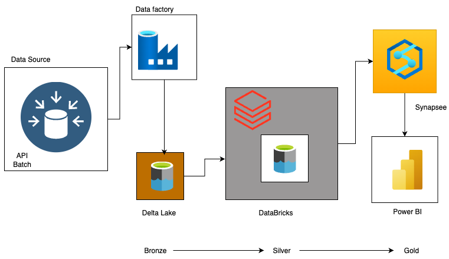
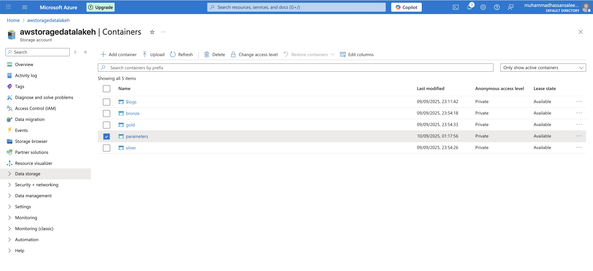
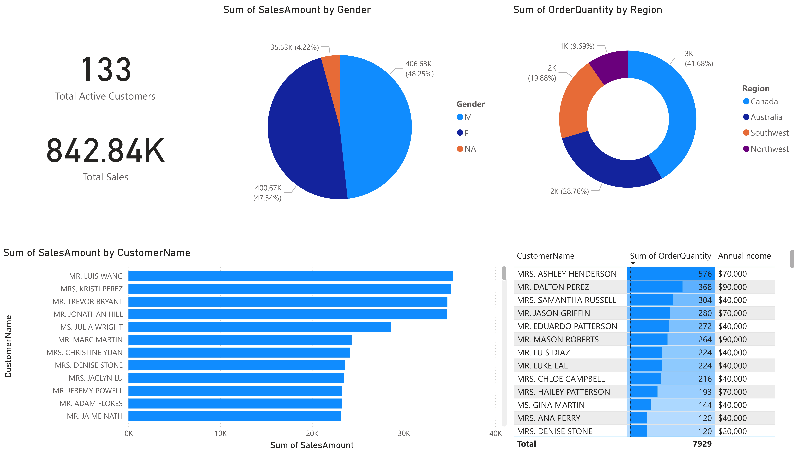
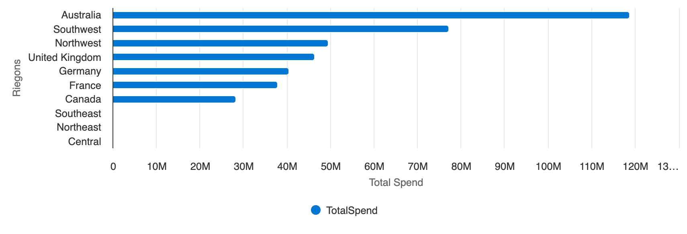
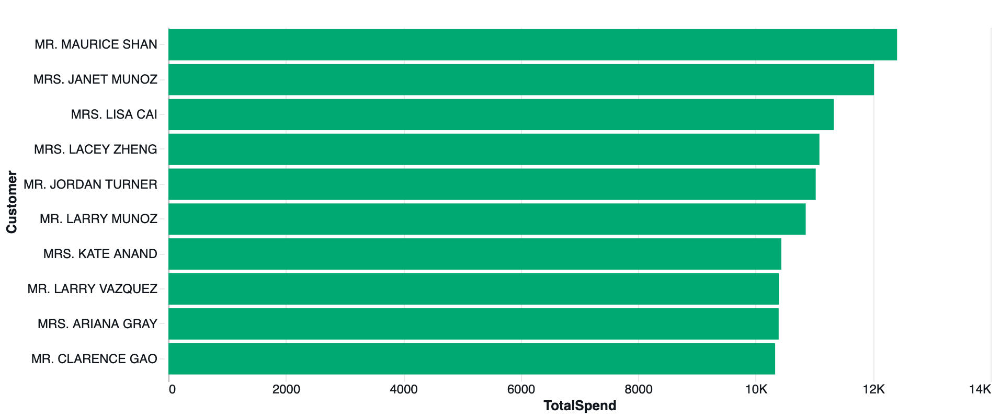
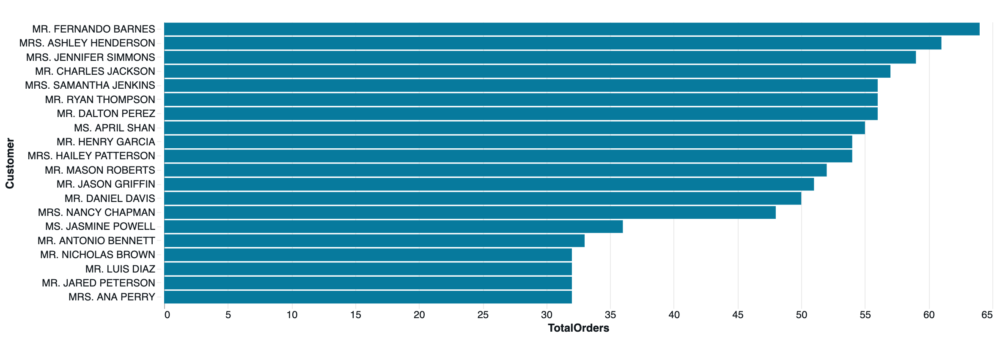
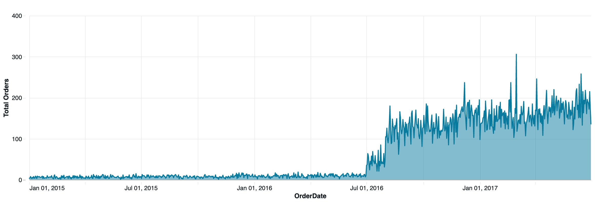

# Azure Data Pipeline – AdventureWorks (Medallion Architecture)

## Overview

This project demonstrates an **end-to-end ETL pipeline** using the **AdventureWorks dataset** on Azure.
The pipeline follows the **Medallion Architecture (Bronze → Silver → Gold)** for data engineering best practices.

🔹 **Bronze (Raw Layer)** – Ingest raw CSV data into Azure Data Lake via **Azure Data Factory (ADF)**.
🔹 **Silver (Cleaned Layer)** – Perform cleaning and transformations in **Azure Databricks** (PySpark).
🔹 **Gold (Business Layer)** – Create reporting-ready views in **Azure Synapse Analytics**.
🔹 **Visualization** – Build interactive dashboards in **Power BI**.

---

## Architecture

Below is the architecture of the pipeline:



1. **Data Factory** – Orchestrates pipelines & ingests raw data into ADLS (Bronze).
2. **Databricks** – Executes transformations, cleansing, and joins to create Silver tables.
3. **Synapse** – Defines Gold views (`fact_sales`, `dim_customers`, `dim_products`, etc.) for analytics.
4. **Power BI** – Connects to Synapse (DirectQuery) for real-time dashboards.

---
## 🗂️ Data Lake Structure (ADLS Gen2)

This project follows the **Medallion Architecture** (Bronze → Silver → Gold) using **Azure Data Lake Storage Gen2**.

### 🔹 Container View in Azure Portal
Below is the screenshot of the containers inside the storage account:



### 🔹 Explanation of Each Layer
- **Bronze (Raw Layer)**  
  - Stores raw ingested files (CSV, JSON, Parquet) directly from **Azure Data Factory (ADF)**.  
  - Data is uncleaned, schema may not be consistent.  

- **Silver (Clean Layer)**  
  - Processed and cleaned data generated using **Azure Databricks**.  
  - Schema is standardized, nulls/duplicates handled, joins applied.  

- **Gold (Business Layer)**  
  - Curated business-ready data exposed through **Azure Synapse Analytics**.  
  - Contains reporting-ready fact and dimension views (e.g. `fact_sales`, `dim_customers`, `dim_products`).  

- **Parameters**  
  - Configuration files, schema mapping, and metadata required by pipelines.  
---
## Repository Structure

```
azure-data-pipeline-adventureworks/
│
├── datafactory/                 # ADF pipeline JSON definitions
├── databricks/                  # Transformation notebooks (Silver layer)
│   └── silver_layer_transformation.ipynb
├── synapse/                     # Synapse SQL scripts (Gold layer)
│   ├── queries/
│   │   ├── create_gold_schema.sql
│   │   ├── fact_sale_table.sql
│   │   ├── gender_sale_ratio.sql
│   │   ├── sales_trend.sql
│   │   ├── top_10_customer_by_order.sql
│   │   ├── top_10_customer_by_spend.sql
│   │   └── total_spend_by_region.sql
│   ├── external_table.sql
│   ├── create_view_gold.sql
│   └── publish_config.json
└── README.md
```

---

## Data Model

The **Gold layer** is modeled in a **star schema**:

* **Fact Table** → `fact_sales` (Sales transactions, OrderDate, ProductKey, CustomerKey, TerritoryKey, SalesAmount).
* **Dimensions** →

  * `dim_customers` (Full Name, Gender, Income, etc.)
  * `dim_products` (Product, Category, Subcategory, Price)
  * `dim_calendar` (Year, Month, Day)
  * `dim_territories` (Region, Country, Continent)

---

## 📈 Dashboards (Power BI)



### Sales by Region


### Top Customers

* Bar chart of **Top 10 customers by spend** and **Top 10 by orders**.



### Sales Trend

* Line chart of **Orders over time**, showing growth between 2015–2017.



---

## ✅ Key Features

* End-to-end ETL pipeline using Azure services.
* Medallion architecture (Bronze → Silver → Gold).
* Automated ingestion (ADF), scalable transformations (Databricks), and optimized serving (Synapse).
* Power BI dashboards showing **sales by gender, region, customer, and trends**.

---

## 🚀 How to Run

1. Deploy ADF pipelines from `datafactory/`.
2. Run Databricks notebook `silver_layer_transformation.ipynb` to generate Silver tables.
3. Run Synapse SQL scripts (`synapse/queries/`) to create Gold views.
4. Connect **Power BI** to Synapse and load Gold views.
5. Build dashboards using provided queries and visuals.

---

## 📌 Future Enhancements

* Add streaming ingestion with **Event Hub**.
* Implement CI/CD for ADF, Databricks, and Synapse scripts.
* Enable Data Quality checks at the Silver layer.

---
